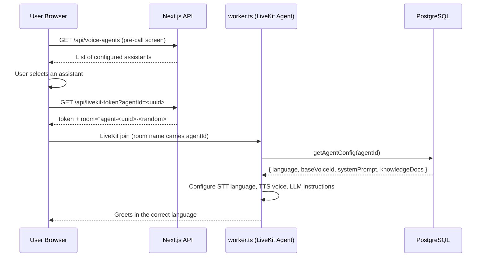
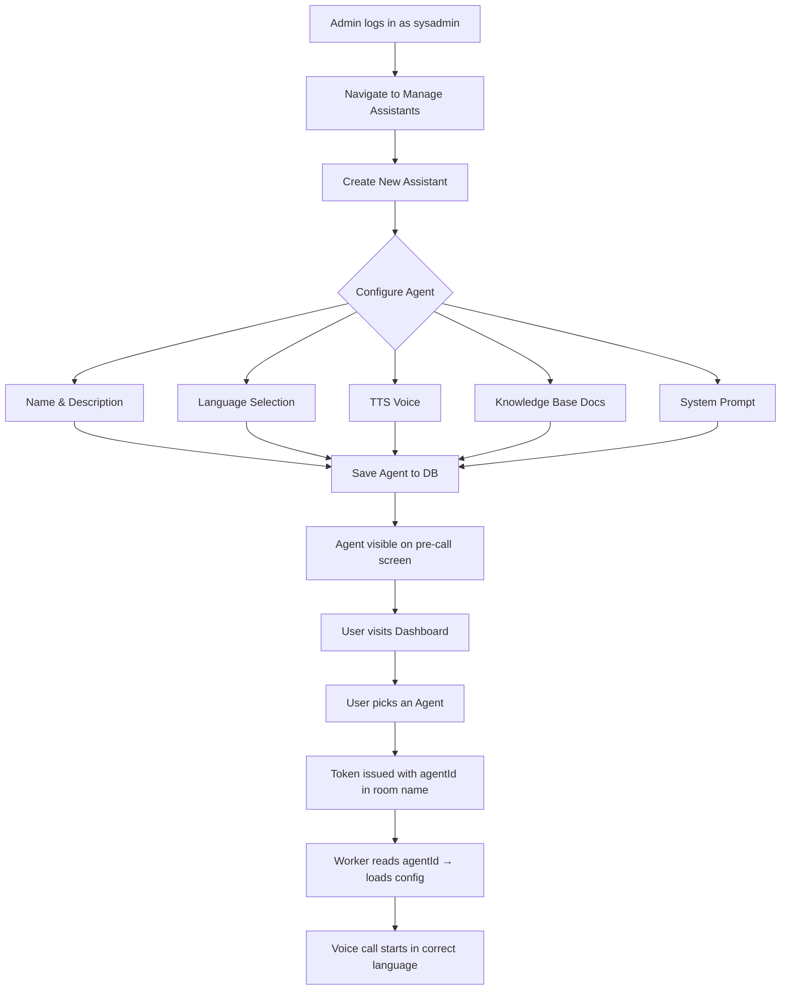

# AI Helpdesk — Voice-Powered AI Support Platform

An enterprise-grade AI helpdesk built with **Next.js**, **LiveKit**, and **Groq**, supporting multiple languages and configurable voice agents with knowledge base integration.

---

## Architecture Overview



---

## Agent Configuration Flow



---

## Tech Stack

| Layer | Technology |
|-------|-----------|
| Frontend | Next.js 15, Tailwind CSS, LiveKit Components |
| Voice Agent | LiveKit Agents SDK, Groq Whisper (STT), Piper TTS |
| LLM | Groq (llama-3.3-70b-versatile) |
| Database | PostgreSQL + Drizzle ORM + pgvector |
| Auth | NextAuth.js (Keycloak / credentials) |
| Media | MinIO object storage |

---

## Supported Languages

| Language | Flag | STT | TTS Voice |
|----------|------|-----|-----------|
| English | 🇺🇸 | Whisper (`en`) | Kokoro voices (US/UK) |
| Hindi | 🇮🇳 | Whisper (`hi`) | Pratham (Piper Indic) |
| Marathi | 🇮🇳 | Whisper (`mr`) | Pratham |
| Bengali | 🇮🇳 | Whisper (`bn`) | Pratham |
| Telugu | 🇮🇳 | Whisper (`te`) | Pratham |
| Tamil | 🇮🇳 | Whisper (`ta`) | Pratham |

---

## Getting Started

### 1. Install dependencies

```bash
npm install
```

### 2. Configure environment

Copy `.env.example` to `.env` and fill in:

```env
DATABASE_URL=postgresql://...
LIVEKIT_URL=ws://localhost:7880
LIVEKIT_API_KEY=...
LIVEKIT_API_SECRET=...
GROQ_API_KEY=...
NEXTAUTH_SECRET=...
NEXTAUTH_URL=http://localhost:3000
```

### 3. Set up the database

```bash
npx drizzle-kit push
```

### 4. Start services

```bash
# Start LiveKit server, Piper TTS, and MinIO via Docker
docker-compose up -d

# Start the LiveKit voice worker
npx ts-node --esm worker.ts

# Start the Next.js dev server
npm run dev
```

Open [http://localhost:3000](http://localhost:3000) in your browser.

---

## Key Features

### 🤖 Multi-Agent Support

Each helpdesk assistant is configured independently with its own language, TTS voice, system prompt, and knowledge base. Users pick the right assistant before starting a call.

### 🗣️ Voice-Powered Helpdesk

End-to-end voice interaction powered by LiveKit. Groq Whisper handles real-time transcription; Piper TTS synthesizes responses in the selected language.

### 📚 Knowledge Base (RAG)

Upload documents per application. The agent searches relevant knowledge base chunks using pgvector embeddings before answering.

### 🎫 Ticket & Escalation System

The AI can raise support tickets and escalate to human executives, developers, or sysadmins — with in-app notifications.

### 🔑 Role-Based Access

Four roles: `user`, `executive`, `developer`, `sysadmin` — each with scoped views and permissions.

---

## API Reference

| Endpoint | Method | Description |
|----------|--------|-------------|
| `/api/voice-agents` | GET | List all configured assistants |
| `/api/voice-agents` | POST | Create a new assistant |
| `/api/voice-agents` | PATCH | Update an assistant |
| `/api/voice-agents` | DELETE | Delete an assistant |
| `/api/livekit-token` | GET | Issue a LiveKit room token (`?agentId=`) |
| `/api/documents` | GET | List knowledge base documents |
| `/api/tickets` | GET/POST | Ticket management |
| `/api/voice/tts` | POST | Generate TTS audio (Voice Lab) |

---

## Project Structure

```
ai-helpdesk/
├── app/
│   ├── (routes)/dashboard/
│   │   ├── _components/          # Shared UI (sidebar, user dashboard)
│   │   ├── admin/agents/         # Admin: Manage Assistants page
│   │   ├── knowledge/            # Knowledge Base management
│   │   ├── tickets/              # Ticket views
│   │   └── voice/                # Voice Lab & clone
│   └── api/
│       ├── voice-agents/         # Agent CRUD
│       ├── livekit-token/        # Room token issuance
│       ├── documents/            # KB document listing
│       └── knowledge/            # Knowledge base upload
├── components/helpdesk/
│   └── AgentSelector.tsx         # Pre-call agent picker
├── lib/
│   ├── voice-logic.ts            # Agent config, KB search, ticket logic
│   └── services/rag.ts           # pgvector RAG search
├── db/
│   └── schema.ts                 # Drizzle ORM schema
└── worker.ts                     # LiveKit voice agent worker
```
